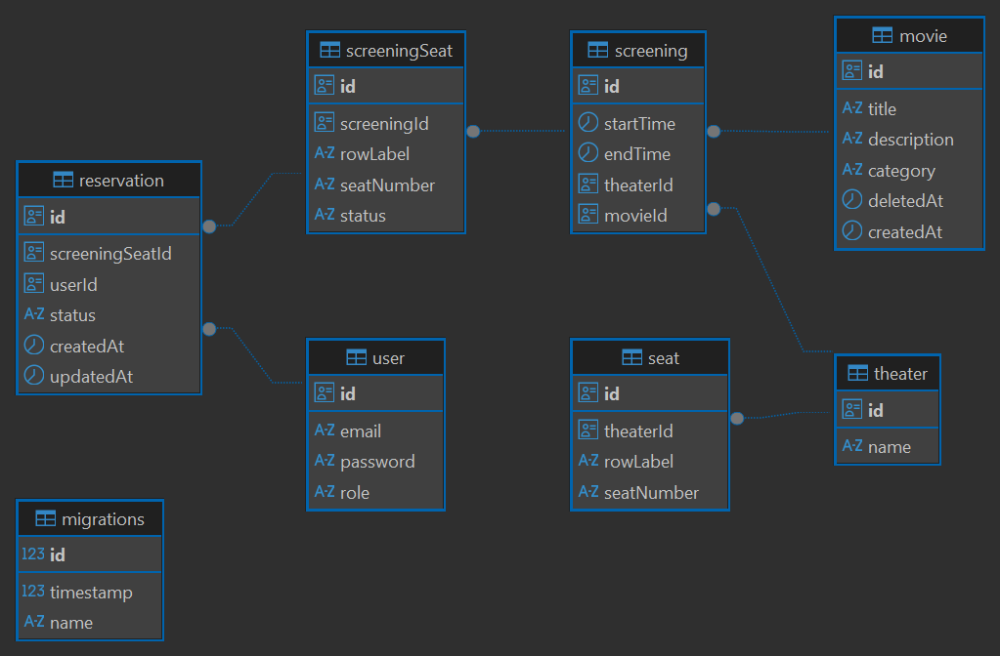

# 🎬 Movie Ticket Reservations System

[](https://github.com/raphael251/movie-tickets-reservation-system/actions/workflows/ci.yml)

## 📌 About the Project

This is a backend system for **movie ticket reservations**, where users can browse screenings, book seats, and manage their reservations.

The project was initially inspired by [roadmap.sh backend path project](https://roadmap.sh/projects/movie-reservation-system), but I extended it with additional features, better architecture, and production-style practices.

---

## 📈 Project Stage

This project is in **active development**.

- Core reservation features are implemented.
- End-to-end tests are partially set up.
- Next improvements focus increasing the tests' coverage percentage, and production-grade enhancements.

---

## 🚀 Features

| Feature                      | Description                                                                             | Status  |
| ---------------------------- | --------------------------------------------------------------------------------------- | ------- |
| User Authentication          | Users can sign up and log in.                                                           | ✅ Done |
| Movie Management (Admin)     | Admins can create, update, and delete (soft delete) movies.                             | ✅ Done |
| Screening Management (Admin) | Admins can manage showtimes, ensuring uniqueness for theater + time.                    | ✅ Done |
| Seat Reservation             | Users can book seats for a specific screening.                                          | ✅ Done |
| Reservation Management       | Users can view and cancel reservations (with rules, e.g. cancellation only before 48h). | ✅ Done |

---

## 🛠️ Tech Stack

- **Backend**: Node.js, TypeScript, Express
- **Database & ORM**: PostgreSQL + TypeORM
- **Testing**: Jest + Supertest (unit & E2E)
- **Tools**: Docker, ESLint, Prettier, commitlint, Husky

---

## 🏗️ Architecture

- **Entities**: `User`, `Movie`, `Theater`, `Seat`, `Screening`, `ScreeningSeat`, `Reservation`

- **Flow**:

  **1.** User signs up/logs in.

  **2.** Admin creates movies and screenings.

  **3.** Screening seats are generated.

  **4.** Users book seats → reservation is created.

  **5.** Reservation rules & validations are enforced.

**Entity-Relationship Diagram**



---

## 🗺️ Technical Roadmap

**Completed ✅**

- Authentication & Authorization
- Movie, Screening, Screening Seat & Reservation APIs with pagination
- Reservation system with cancellation rules
- Input validation & standardized responses
- End-to-end testing setup
- Logging system (Winston)
- Dependency Injection container (Inversify)

**Planned / In Progress 🚧**

- Improved seeder verification

📖 See the [full roadmap](docs/ROADMAP.md) for detailed progress.

---

## ⚠️ Error Handling Strategy

The system follows a consistent error-handling approach:

**400 Bad Request →** invalid inputs

**409 Conflict →** business logic errors (e.g. email already registered)

**500 Internal Server Error →** unexpected issues (with stack traces logged, not exposed to clients)

This design ensures security (no leaking stack traces) and predictable responses for API consumers.

---

## ⚡Getting Started

To get started with the project, follow these steps:

1. Clone the repository:

   ```bash
   git clone https://github.com/raphael251/movie-tickets-reservation-system.git
   cd movie-tickets-reservation-system
   ```

2. Install the dependencies:

   ```bash
    npm install
   ```

3. Set up the environment variables:

   Copy `.env.example` → `.env` and adjust values.

4. Spin up the database using Docker:

   ```bash
   docker-compose up -d
   ```

5. Build the project:

   ```bash
   npm run build
   ```

6. Start the development server:
   ```bash
   npm run start:dev
   ```

---

## 🧪 Testing

The unit tests are automated via GitHub Actions every time a pull request is open for the main branch.

The end-to-end tests are able to run in the GitHub Action as well, but not in an automated way. I can be run by a manual trigger in the repository. Maybe at some point I will activate it to be run automatically as the unit tests.

Run unit and end-to-end tests locally:

```sh
npm run test:unit  # unit tests
npm run test:e2e   # end-to-end tests
```
